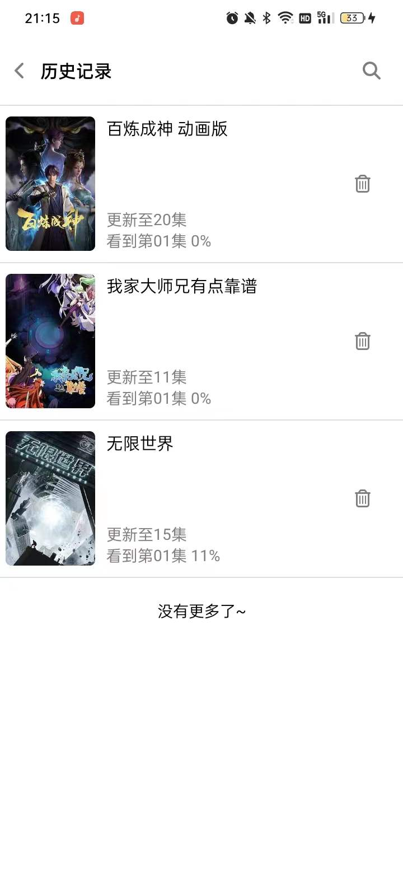

# Sakura

用于看番的 app，也支持看漫画和小说。

安装包下载地址：[https://github.com/HGGshiwo/Sakura/releases](https://github.com/HGGshiwo/Sakura/releases)

目前看番存在的问题:

- 某些稳定的视频源收费，并且和谐严重
- 国内浏览器屏蔽了看番网站
- 国外浏览器看番体验感差
- 某些 app 数据源不稳定，容易挂
- 某些 app UI 设计较为简单，不够人性化
- 某些开源的 app 不提供安装包，需要自己 build，用户体验感差

## 特点：

- react native 实现
- 具体的 UI 设计参考了 B 站
- 使用多个数据源，减小数据源失效带来的问题
- 多个用户主题可供选择
- 播放器支持手势控制：
  - 长按加速
  - 水平滑动拖动进度条
  - 竖直滑动改变亮度/音量
  - 点击空白处打开/关闭控制器

## UI 界面

<table>
  <tr>
    <td align=center>红色主题</td>
    <td align=center>蓝色主题</td>
    <td align=center>白色主题</td>
    <td align=center>黄色主题</td>
  </tr>
  <tr>
    <td></td>
    <td></td>
    <td></td>
    <td></td>
  </tr>   
  <tr>
    <td colspan=4 align=center>全屏播放界面</td>
  </tr>  
  <tr>
    <td colspan=4></td>
  </tr>
  <tr>
    <td align=center>视频播放</td>
    <td align=center>漫画播放器</td>
    <td align=center>小说播放器</td>
    <td align=center>时间表</td>
  </tr>
  <tr>
    <td></td>
    <td></td>
    <td></td>
    <td></td>
  </tr>
  <tr>
    <td align=center>首页</td>
    <td align=center>分类</td>
    <td align=center>用户界面</td>
    <td align=center>全部动漫</td>
  </tr>
  <tr>
    <td></td>
    <td></td>
    <td></td>
    <td></td>
  </tr>
  <tr>
    <td align=center>追番</td>
    <td align=center>历史记录</td>
    <td align=center>搜索界面</td>
    <td align=center>排行榜</td>
  </tr>
  <tr>
    <td></td>
    <td></td>
    <td></td>    
    <td></td>
  </tr>
 </table>

## todo

- 搜索历史功能
- 下载功能
- 增加播放器设置
- 完成漫画和小说部分页面
## 参考项目

- [https://github.com/670848654/SakuraAnime.git](https://github.com/670848654/SakuraAnime.git)
- [https://github.com/androiddevnotesforks/Imomoe.git](https://github.com/androiddevnotesforks/Imomoe.git)
