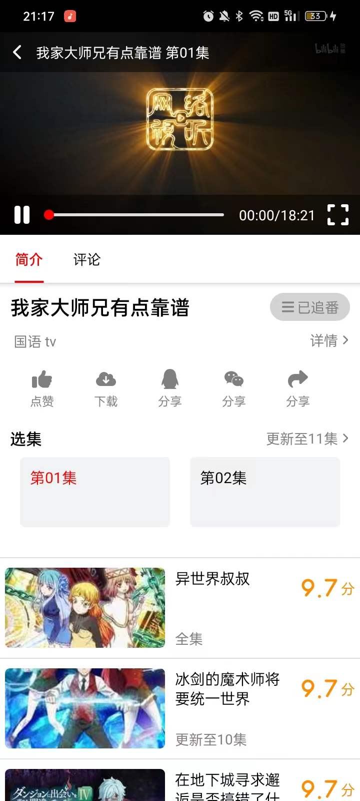

# Sakura

用于看番的 app，之后也支持看漫画和小说。

安装包下载地址：[https://github.com/HGGshiwo/Sakura/releases/tag/v1.0.0-alpha](https://github.com/HGGshiwo/Sakura/releases/tag/v1.0.0-alpha)

目前看番存在的问题:

- 某些稳定的视频源收费，并且和谐严重
- 国内浏览器屏蔽了看番网站
- 国外浏览器看番体验感差
- 某些 app 数据源不稳定，容易挂
- 某些 app UI 设计较为简单，不够人性化
- 某些开源的 app 不提供安装包，需要自己 build，用户体验感差

## 特点：

- 视频数据和搜索功能由[www.yinghuacd.com](http://www.yinghuacd.com/)提供
- react native 实现
- 具体的 UI 设计参考了 B 站

## UI 界面

<table>
   <tr>
    <td colspan=3>播放界面</td>
  </tr>
  <tr>
    <td colspan=3></td>
  </tr>
  <tr>
    <td align=center>首页</td>
    <td align=center>分类</td>
    <td align=center>用户界面</td>
  </tr>
  <tr>
    <td></td>
    <td></td>
    <td></td>
  </tr>
  <tr>
    <td align=center>播放界面</td>
    <td align=center>历史记录</td>
    <td align=center>搜索界面</td>
  </tr>
  <tr>
    <td></td>
    <td></td>
    <td></td>
  </tr>
    <tr>
    <td align=center>全部动漫</td>
    <td align=center>追番</td>
    <td align=center>索引</td>
  </tr>
  <tr>
    <td></td>
    <td></td>
    <td align=center>todo</td>
  </tr>
 </table>

## todo

- 索引页面
- 时间表页面
- 历史记录
- 下载功能
- 完善播放器功能

## 参考项目

- [https://github.com/670848654/SakuraAnime.git](https://github.com/670848654/SakuraAnime.git)
- [https://github.com/androiddevnotesforks/Imomoe.git](https://github.com/androiddevnotesforks/Imomoe.git)
